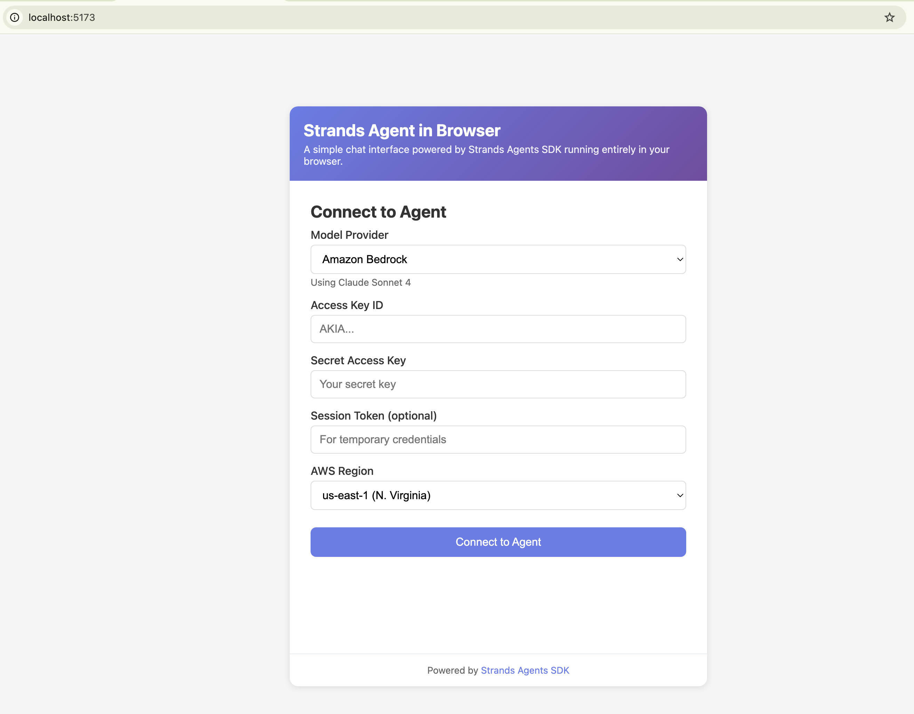
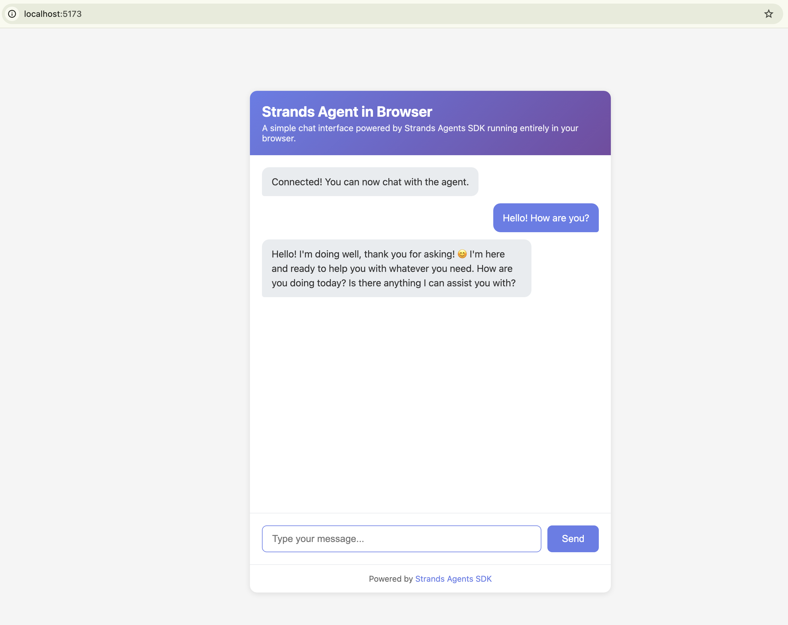

# Running Strands Agents in the Browser & Chrome Extension

## Overview

This project demonstrates how to run a Strands Agent entirely in the browser using the TypeScript SDK with Vite as the build tool. The example creates a simple chat interface where users can interact with an agent directly from their web browser or as a Chrome extension.


| Feature | Description |
|---------|-------------|
| Agent Structure | Single agent architecture |
| Architecture | Client-side only (browser) |
| Build Tool | Vite |
| Model Providers | Amazon Bedrock (Claude Sonnet 4), OpenAI (GPT-4o) |
| Extension Support | Chrome Extension with Manifest V3, Side Panel API |

## Prerequisites

- Node.js 18.x or later
- One of the following:
  - AWS credentials with Amazon Bedrock access (Access Key ID, Secret Access Key, and optionally Session Token for temporary credentials)
  - OpenAI API key
- Basic TypeScript and web development knowledge
- Chrome browser (for extension features)

## Project Structure

```
strands-browser-extension/
├── .github/
│   └── workflows/
│       └── ci.yml            # GitHub Actions CI workflow
├── icons/                    # Extension icons (16x16, 32x32, 48x48, 128x128)
├── images/                   # Documentation images
│   └── browser_agent.png
├── scripts/                  # Build scripts
│   └── post-build.js         # Extension post-build tasks
├── src/                      # Source code
│   ├── main.ts               # Agent setup and DOM interaction
│   ├── style.css             # Chat interface styling
│   ├── utils/                # Utility functions
│   │   └── validation.ts     # Input validation utilities
│   └── vite-env.d.ts         # Vite type declarations
├── tests/                    # Test files
│   ├── setup.ts              # Test environment setup
│   ├── manifest.test.ts      # Manifest validation tests
│   ├── validation.test.ts    # Validation utility tests
│   ├── post-build.test.ts    # Build script tests
│   └── main.test.ts          # Application logic tests
├── index.html                # Web application entry point
├── popup.html                # Extension popup entry point
├── manifest.json             # Chrome Extension Manifest V3
├── package.json              # Dependencies and scripts
├── tsconfig.json             # TypeScript configuration
├── vite.config.ts            # Vite configuration
├── vitest.config.ts          # Vitest test configuration
├── .eslintrc.json            # ESLint configuration
└── README.md                 # This file
```

## Quick Start

### Installation

```bash
npm install
```

### Running as Web Application

```bash
npm run dev
```

This will start the Vite dev server and open `http://localhost:5173` in your browser.

## Building the Extension

### Development Build

For development with automatic rebuilding on file changes:

```bash
npm run dev:extension
```

This command:
- Builds the extension in development mode
- Watches for file changes
- Automatically rebuilds when source files are modified
- Outputs to the `dist/` directory

After running this command, you can load the extension in Chrome (see [Local Testing](#local-testing) below). The extension will need to be reloaded manually in Chrome when changes are detected.

### Production Build

For a production-ready build:

```bash
npm run build:extension
```

This command:
- Builds optimized, minified code
- Copies manifest.json to dist/
- Copies all icon files to dist/icons/
- Outputs a complete extension package in `dist/`

The production build is optimized for:
- Smaller file sizes
- Better performance
- Distribution to users

## Local Testing

### Loading the Extension as Unpacked in Chrome

1. **Build the extension** (if not already built):
   ```bash
   npm run build:extension
   ```

2. **Open Chrome Extensions page**:
   - Navigate to `chrome://extensions/` in your Chrome browser
   - Or click the menu (⋮) → More Tools → Extensions

3. **Enable Developer Mode**:
   - Toggle the "Developer mode" switch in the top-right corner

4. **Load the extension**:
   - Click the "Load unpacked" button
   - Navigate to your project directory
   - Select the `dist/` folder
   - Click "Select Folder"

5. **Verify the extension**:
   - The "Strands Browser Agent" extension should appear in your extensions list
   - The extension icon should appear in your browser toolbar
   - Click the icon to open the popup interface

6. **Reload after changes**:
   - After making code changes and rebuilding, click the refresh (🔄) icon on the extension card in `chrome://extensions/`
   - Or use the keyboard shortcut: Ctrl+R (Windows/Linux) or Cmd+R (Mac) while on the extensions page

### Testing the Extension

Once loaded:

1. **Open the extension**:
   - Click the extension icon in the toolbar
   - Or right-click the icon and select "Open side panel" (Chrome 114+)

2. **Configure credentials**:
   - Select your model provider (Bedrock or OpenAI)
   - Enter your API credentials
   - Click "Connect to Agent"

3. **Test the chat interface**:
   - Type a message in the input field
   - Press Enter or click Send
   - Verify the agent responds correctly



## Testing

### Running Unit Tests

Run all tests once:
```bash
npm test
```

Run tests in watch mode (re-runs on file changes):
```bash
npm run test:watch
```

Run tests with UI:
```bash
npm run test:ui
```

Generate coverage report:
```bash
npm run test -- --coverage
```

### Test Suite Overview

The project includes comprehensive unit tests covering:

- **Manifest Validation** (`tests/manifest.test.ts`)
  - Validates Chrome extension manifest structure
  - Ensures all required fields are present
  - Checks icon paths and permissions
  - Validates version format and field lengths

- **Validation Utilities** (`tests/validation.test.ts`)
  - AWS credential format validation
  - OpenAI API key validation
  - Message input sanitization
  - Extension permission validation

- **Build Script** (`tests/post-build.test.ts`)
  - Validates build process requirements
  - Checks file copying logic
  - Ensures dist directory structure

- **Application Logic** (`tests/main.test.ts`)
  - DOM manipulation testing
  - Form validation logic
  - Message handling
  - Extension environment detection

## Linting and Type Checking

### Run ESLint

Check for linting errors:
```bash
npm run lint
```

Automatically fix linting errors:
```bash
npm run lint:fix
```

### Type Check

Run TypeScript type checking without emitting files:
```bash
npm run type-check
```

This is useful for catching type errors before building or committing code.

## Available Scripts

| Script | Description |
|--------|-------------|
| `npm run dev` | Start web development server |
| `npm run build` | Build web application for production |
| `npm run build:prod` | Build web application with production environment |
| `npm run preview` | Preview production web build |
| `npm run build:extension` | Build production extension package |
| `npm run dev:extension` | Build extension in watch mode for development |
| `npm test` | Run all unit tests once |
| `npm run test:watch` | Run tests in watch mode |
| `npm run test:ui` | Run tests with interactive UI |
| `npm run lint` | Run ESLint to check code quality |
| `npm run lint:fix` | Automatically fix ESLint errors |
| `npm run type-check` | Run TypeScript type checking |

## Chrome Extension Features

### Manifest V3 Support
- Modern Chrome Extension using Manifest V3
- Permissions: `storage`, `sidePanel`
- Compatible with Chrome's latest security requirements

### Side Panel API
The extension supports Chrome's Side Panel API for an enhanced user experience:

- **Browser Version**: Requires Chrome 114 or later
- **Benefits**:
  - Persistent panel alongside web content
  - Better integration with browser workflow
  - More screen space for conversations
  - Stays open while browsing

- **Graceful Fallback**: 
  - On older Chrome versions, opens as a traditional popup
  - All functionality preserved in both modes

- **How to Use**:
  1. Right-click the extension icon
  2. Select "Open side panel" (Chrome 114+)
  3. Panel opens on the side of your browser window

### Extension-Specific Optimizations
- Popup dimensions: 400x600 pixels
- Responsive layout that works within popup constraints
- All existing chat functionality preserved (credentials form, message handling)
- Extension-specific styling and layout adjustments

## Chrome Version Requirements

| Feature | Minimum Chrome Version | Notes |
|---------|----------------------|-------|
| Extension (Basic) | Chrome 88+ | Manifest V3 support |
| Side Panel API | Chrome 114+ | Enhanced UX, graceful fallback to popup |
| Storage API | Chrome 88+ | Required for settings persistence |

**Recommended**: Chrome 114 or later for the best experience with Side Panel support.

## Continuous Integration

This project uses GitHub Actions for automated CI/CD. The workflow runs on:
- Push to `main` or `develop` branches
- Pull requests to `main` or `develop` branches

### CI Pipeline Jobs

1. **Lint and Type Check**
   - Runs ESLint on all TypeScript files
   - Performs TypeScript type checking
   - Fails if linting errors or type errors are found

2. **Run Tests**
   - Executes all unit tests
   - Generates test coverage report
   - Uploads coverage to Codecov (if configured)

3. **Build Extension** (Production)
   - Builds the extension in production mode
   - Verifies all required files are present
   - Validates manifest.json structure
   - Uploads build artifacts (retained for 30 days)

4. **Build Extension** (Development)
   - Runs only on non-main branches
   - Creates development build for testing
   - Uploads dev artifacts (retained for 7 days)

5. **Security Audit**
   - Runs npm audit to check for vulnerable dependencies
   - Fails if high-severity vulnerabilities are found

### Viewing Build Artifacts

After a successful CI run:
1. Go to the Actions tab in GitHub
2. Select the completed workflow run
3. Scroll to the "Artifacts" section
4. Download `chrome-extension-build` to get the production extension package

## Key Concepts

### Browser-Based Agent

The agent runs entirely in the browser, which means:

1. **No backend required** - API calls go directly from the browser to the model provider (development only - see Security Considerations)
2. **Simple deployment** - Can be hosted on any static file server (do not bundle credentials)

### Agent Configuration

In browser environments, credentials must be passed explicitly. The application supports two model providers:

#### Amazon Bedrock

```typescript
import { Agent, BedrockModel } from "@strands-agents/sdk";

const agent = new Agent({
  model: new BedrockModel({
    region: "us-east-1",
    clientConfig: {
      credentials: {
        accessKeyId: "...",
        secretAccessKey: "...",
        sessionToken: "...",  // Optional, for temporary credentials
      },
    },
  }),
  systemPrompt: "You are a helpful assistant running in the browser."
});
```


#### OpenAI

```typescript
import { Agent } from "@strands-agents/sdk";
import { OpenAIModel } from "@strands-agents/sdk/openai";

const agent = new Agent({
  model: new OpenAIModel({
    apiKey: "sk-...",
    modelId: "gpt-4o",
    // Required to allow OpenAI SDK to run in browser environments
    clientConfig: {
      dangerouslyAllowBrowser: true,
    },
  }),
  systemPrompt: "You are a helpful assistant running in the browser."
});
```

### Streaming Responses

Streaming displays the response progressively as it's generated, providing immediate feedback:

```typescript
for await (const event of agent.stream(userMessage)) {
  if (
    event.type === "modelContentBlockDeltaEvent" &&
    event.delta.type === "textDelta"
  ) {
    responseText += event.delta.text;
    // Update UI with each chunk
  }
}
```



### Vite

Vite is a build tool that enables browser-based development:

- **TypeScript compilation** - Compiles `.ts` files to JavaScript since browsers can't run TypeScript directly
- **Module bundling** - Resolves and bundles dependencies (like `@strands-agents/sdk`) so browsers can load them
- **Dev server** - Serves files locally with automatic reload on save
- **Production builds** - Creates optimized, minified files for deployment

## Security Considerations

When running agents in the browser, be aware of:

1. **Credentials Exposure** - AWS credentials and OpenAI API keys used in browser code are visible in the network tab and browser developer tools
2. **For Production** - Use a backend proxy or secure token-based authentication
3. **Development Only** - This tutorial is intended for development and demonstration purposes
4. **Never commit credentials** - Use environment variables or secure vaults for sensitive data

## Troubleshooting

### Extension Not Loading

- Ensure you've built the extension: `npm run build:extension`
- Verify the `dist/` folder contains `manifest.json` and `icons/` directory
- Check Chrome's extension error messages in `chrome://extensions/`
- Try removing and re-adding the extension

### Type Errors During Development

- Run `npm run type-check` to identify TypeScript errors
- Ensure all dependencies are installed: `npm install`
- Check that `@types/chrome` is installed for extension API types

### Tests Failing

- Ensure all dependencies are installed: `npm ci`
- Check that test files follow the naming pattern `*.test.ts`
- Review test output for specific error messages
- Run tests in watch mode for easier debugging: `npm run test:watch`

### Build Errors

- Clear the dist folder: `rm -rf dist/`
- Clear node_modules and reinstall: `rm -rf node_modules/ && npm install`
- Check that all source files are valid TypeScript
- Review Vite error messages for specific issues

## Contributing

When contributing to this project:

1. Run tests before committing: `npm test`
2. Ensure linting passes: `npm run lint`
3. Check types: `npm run type-check`
4. Test the extension locally after building
5. Follow existing code style and patterns

The CI pipeline will automatically run these checks on pull requests.

## Additional Resources

- [Strands Agents Documentation](https://strandsagents.com/latest/)
- [Vite Documentation](https://vitejs.dev/)
- [Chrome Extension Development](https://developer.chrome.com/docs/extensions/)
- [Chrome Side Panel API](https://developer.chrome.com/docs/extensions/reference/sidePanel/)
- [Vitest Documentation](https://vitest.dev/)
